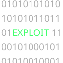
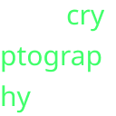
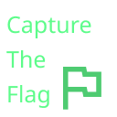
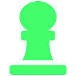
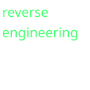
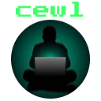

# Discord-emojis

A repo of Cyber Security / Hacking themed emojis for the Discord app.

- these emojis are 128x128 and are easy to use
- these emojis are made with the Dark theme in mind

---

## Emojis 

| `:name:`                  | description                                 |
|---------------------------|---------------------------------------------|
| `:afk:`                   |                   |  
| `:arch:`                  |                  |
| `:binary_exploit:`        |        |
| `:brave:`                 |                 |
| `:burpsuite:`             |             |
| `:copypaste:`             |             |
| `:crypto:`                |                |
| `:ctf:`                   |                   |
| `:duck`                   |                  |
| `:firefox:`               |               |
| `:forensics:`             |             |
| `:ftw:`                   |                   |
| `:github:`                |                |
| `:good_luck:`             |             |
| `:google:`                |                |
| `:got_flag:`              |              |
| `:hacking:`               |               |
| `:jeopardy:`              |              |
| `:kali_1:`                |                |
| `:level_up:`              |              |
| `:linux:`                 |                 |
| `:obsidian:`              |              |
| `:picoCTF:`               |               |
| `:pwn:`                   |                   |
| `:python:`                |                |
| `:reverse_eng:`           |           |
| `:sec_plus:`              |              |
| `:skills:`                |                |
| `:vmware:`                |                |
| `:web_exploit:`           |           |
| `:yes:`                   |                   |
| `:you_can:`               |               |
| `:yt:`                    |                    |
| `:docker:`                |                |
| `:hint:`                  |                  |
| `:metasploit:`            |            |
| `:nmap:`                  |                  |
| `:sqlmap:`                |                |
| `:cewl:`                  |                  |
| `:foxyproxy:`             |             |
| `:jtr:`                   |                   |

